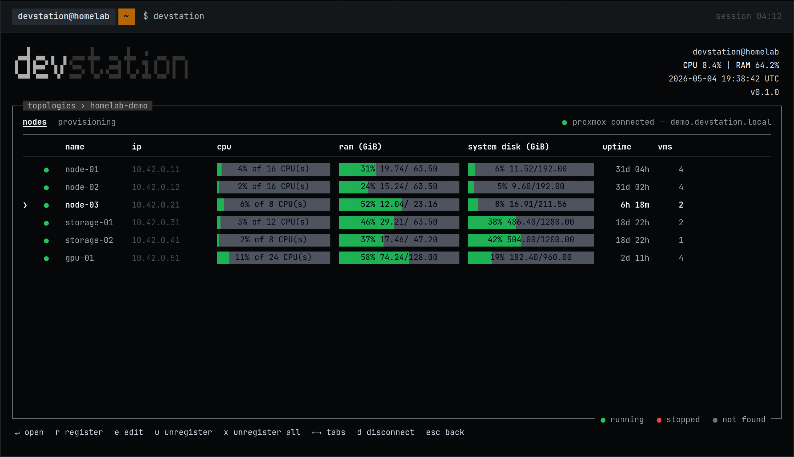

# DevStation

**Describe your homelab topology once. DevStation builds it — and rebuilds it — on demand.**

<div align="center">

[](https://github.com/devstationtech/devstation/actions/workflows/release.yml)
[](LICENSE)
[](CONTRIBUTING.md)

[](https://www.typescriptlang.org)
[](https://deno.com)
[](https://opentofu.org)
[](https://www.proxmox.com)
[](https://modelcontextprotocol.io)
[](#install)

**[devstation.tech](https://devstation.tech)** · [Docs](https://devstation.tech/en/docs/concepts) · [Engineering blog](https://devstation.tech/en/engineering)

</div>

<!-- Swap for docs/assets/demo.gif once recorded — see docs/assets/demo.tape -->
<p align="center">
  
</p>

DevStation is a single-binary CLI for people who have hardware and want a working
environment on it — without first learning a hypervisor UI, an IaC language and a
configuration manager. You describe your environment as a **topology**: clusters,
nodes, virtual machines, and the services that run on them. DevStation provisions
the VMs on Proxmox, installs the services over SSH, and can recreate the whole
thing whenever you need.

No Deno, no OpenTofu install, no dependencies to set up — one binary.

Topologies is the first feature of a broader open-source **engineering cockpit**:
the project is [built to grow into more](docs/vision.md) without changing what
already ships. Multi-provider by design; Proxmox is the provider shipped today.

## Why

There is a gap between having hardware and having useful infrastructure. A
homelab means choosing a hypervisor, learning its UI, writing IaC or clicking
through screens, preparing each machine over SSH, and documenting it all — then
repeating everything when something breaks. The usual result is idle hardware, or
an artisanal setup nobody can rebuild. DevStation closes that gap with one
declarative model — the topology is the source of truth; provisioning and install
are its consequences. More in [docs/vision.md](docs/vision.md).

## Install

Linux / macOS:

```sh
curl -fsSL https://raw.githubusercontent.com/devstationtech/devstation/main/install.sh | sh
```

Windows (PowerShell):

```powershell
irm https://raw.githubusercontent.com/devstationtech/devstation/main/install.ps1 | iex
```

The installer pulls the latest release for your platform straight from GitHub
Releases, verifies its checksum, and installs a single binary. No custom domain
or CDN is involved — the same GitHub-native source powers the in-app self-update.

## Quick start

You need a machine running [Proxmox VE](https://www.proxmox.com/en/proxmox-virtual-environment)
that your computer can reach, and an API token for it. Then run `devstation` —
the TUI guides you through the rest, in this order:

1. **Vault** — create the local vault; store your Proxmox credentials and an SSH key.
2. **Cluster & nodes** — register your Proxmox cluster and its nodes.
3. **Images & sizes** — pick base OS images (Ubuntu, Debian) and define compute profiles.
4. **Virtual machines** — declare VMs from a size and an image, with free-form tags.
5. **Provision** — `plan` shows exactly what will change; `apply` creates the VMs.
6. **Station & services** — register services from blueprints (Docker, K3s, ArgoCD…) and install.

Nothing is opaque along the way: the provisioning plan, each install step and the
execution logs stay visible and auditable.

## What's inside

| Capability | What it does | Learn more |
| --- | --- | --- |
| **Topology model** | Two decoupled layers: infrastructure (Cluster → Node → VM) and logical (Station → Service). | [docs/topology.md](docs/topology.md) |
| **Proxmox provider** | Connects to your cluster; manages nodes, VMs, images and sizes; live status in the TUI. | [docs/concepts.md](docs/concepts.md) |
| **Provisioning** | `plan` / `apply` / `destroy` through a bundled OpenTofu runtime — no IaC to write, nothing to install. | [docs/concepts.md](docs/concepts.md#provisioning) |
| **Blueprints & services** | Declarative YAML recipes installed over SSH — a bundled catalog plus your own. | [docs/blueprint-dsl.md](docs/blueprint-dsl.md) |
| **Local vault** | Secrets encrypted at rest behind a master password; topologies never hold plain text. | [docs/concepts.md](docs/concepts.md#vault) |
| **MCP server** | Drive DevStation from an LLM agent, gated by a scoped access token. | [below](#mcp--drive-it-from-an-agent) |
| **Terminal UI** | A React Ink TUI over the same engine; `/update` swaps the binary in place. | — |

## Blueprints

A blueprint is a folder with a `blueprint.yaml`: a declarative recipe that
installs and operates a service over SSH — steps with health checks, secret
handoff between roles, rollback and uninstall. DevStation bundles a small
official catalog (`docker`, `k3s`, `portainer`, `jenkins`, `argocd`), and your
own live in `~/devstation/blueprints`:

```sh
devstation blueprint register ./my-blueprint
```

The command validates the blueprint with the real parser and copies it into your
user catalog. A user blueprint with the same name as a bundled one overrides it —
so you can fork any official recipe. The full DSL reference is
[docs/blueprint-dsl.md](docs/blueprint-dsl.md), and the repo ships an agent skill
([`.agents/skills/blueprint-dsl/`](.agents/skills/blueprint-dsl/SKILL.md)) so an
AI assistant can author blueprints with full command of the DSL.

Blueprints are also the easiest way to contribute — see
[CONTRIBUTING.md](CONTRIBUTING.md#add-a-blueprint).

## MCP — drive it from an agent

The engine exposes an MCP server in the same binary (`devstation mcp serve` /
`devstation mcp install`), gated by a scoped access token. An agent can read the
topology, provision nodes, install services and query the vault through the same
boundary the TUI uses — destructive operations carry explicit risk metadata. The
project's own e2e suite runs through this surface against a real Proxmox node;
the [engineering blog](https://devstation.tech/en/engineering) tells that story.

## Status

DevStation is **pre-alpha** (v0.1.x). It is used daily against real homelabs and
the full suite — unit, integration, architecture and MCP e2e — gates every
release, but the topology model and the blueprint DSL may still change between
versions. Your data lives under `~/.devstation` (topology, vault, user
blueprints); removing that directory and the binary uninstalls everything.
Found a problem? [Open an issue](https://github.com/devstationtech/devstation/issues).

## Build from source

Requires [Deno](https://deno.com) 2.x.

```sh
git clone https://github.com/devstationtech/devstation
cd devstation
make run     # run the TUI from source
make test    # full test suite
make build   # compile the single binary into dist/
```

## Architecture

The engine is a hexagonal, DDD codebase; the Ink UI talks to it only over
JSON-RPC/stdio, and the same engine exposes the MCP server. The
[engineering blog](https://devstation.tech/en/engineering) documents the
decisions; [AGENTS.md](AGENTS.md) holds the conventions (rules and skills under
`.agents/`), and [CONTRIBUTING.md](CONTRIBUTING.md) gets you started.

## License

Released under the MIT License — see [LICENSE](LICENSE).
